  <picture>
    <source media="(prefers-color-scheme: dark)"  srcset="./terminal.svg">
    <source media="(prefers-color-scheme: light)" srcset="./terminal-light.svg">
    
  </picture>

  
  

---

### 🔬 Pesquisa

**Iniciação Científica** · IFSP - Campus Presidente Epitácio · desde mar/2026

> ### Esteganografia utilizando Redes Adversárias Generativas
> Desenvolvimento e avaliação de um modelo de aprendizado profundo para **ocultar e
> decodificar mensagens em imagens digitais**.

`redes neurais` · `processamento de imagem` · `segurança da informação`

Participei do **SBSeg 2026** - XXVI Simpósio Brasileiro de Cibersegurança, em Búzios/RJ.

---

### 🎓 Formação

**Bacharelado em Ciência da Computação** - IFSP, Presidente Epitácio/SP · 2023 – 2026

Monitor acadêmico bolsista:

| período | disciplina |
|---|---|
| 2025 | Laboratório de Informática |
| 2024 | Algoritmos e Lógica de Programação |

---

### 🛠 Stack

---

### 📌 Projetos

| repositório | o que é |
|---|---|
| [**PovRay**](https://github.com/willehersomo/PovRay) | Compilador para a linguagem POV-Ray — Java + ANTLR |
| [**Sistema-de-Arquivos**](https://github.com/willehersomo/Sistema-de-Arquivos) | Simulação de um sistema de arquivos EXT, em C |
| [**GAN**](https://github.com/willehersomo/GAN) | Redes adversárias generativas — base da pesquisa de IC |
| [**Visao-Computacional**](https://github.com/willehersomo/Visao-Computacional) | Processamento digital de imagens em MATLAB |
| [**Sistemas-Distribuidos**](https://github.com/willehersomo/Sistemas-Distribuidos) | Comunicação, RPC e concorrência distribuída |
| [**Linguagem-de-Montagem**](https://github.com/willehersomo/Linguagem-de-Montagem) | Assembly x86-64 |
| [**thread**](https://github.com/willehersomo/thread) | Programação concorrente com threads POSIX, em C |
| [**xadrez-pyqt**](https://github.com/willehersomo/xadrez-pyqt) | Xadrez com interface em PyQt |

---

